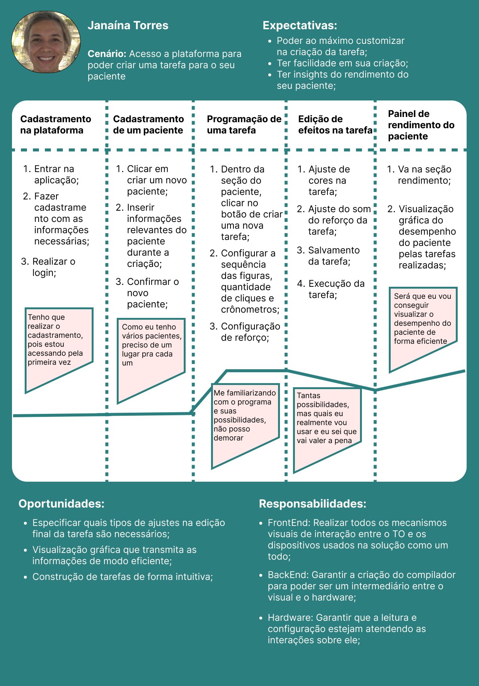
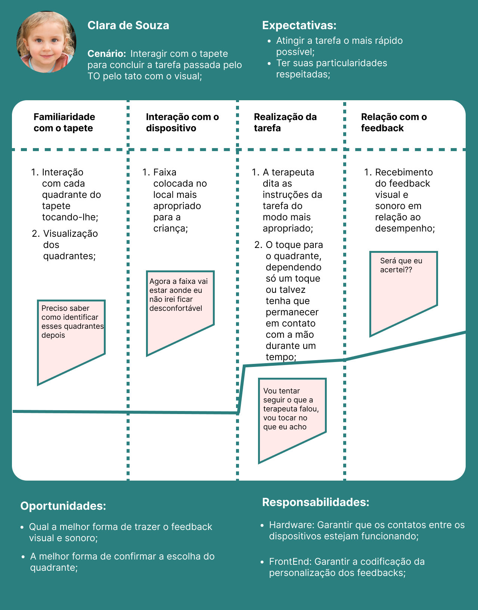
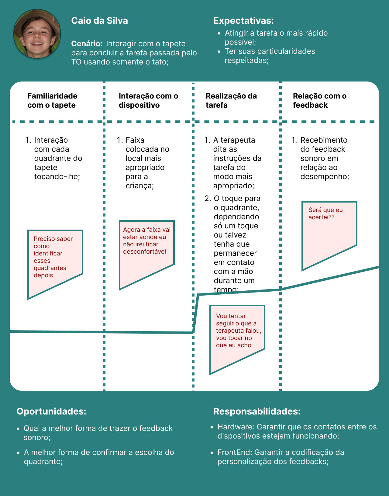

# Entendimento da Experiência do Usuário

## Mapa do jornada do usuário

Pontos de atenção:

- Cenário: Aborda o objetivo do usuário naquele momento ou, por assim dizer, a sua necessidade;

- Expectativas: O que o usuário irá ganhar com a aplicação;

- Oportunidades: Insights para melhorias futuras e pontos de atenção referente ao usuário;

- Responsabilidades: O que os desenvolvedores vão ter que fazer, qual a divisão de tarefas;

Observação: Vai haver marcação de sentimentos pela curva da linha;

### Jornada da terapeuta ocupacional

### Jornada da criança sem deficiência visual

### Jornada da criança com deficiência visual

