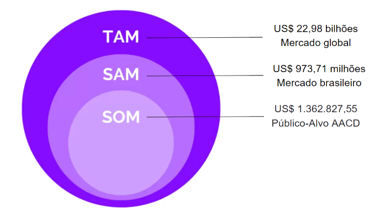

# Entendimento de negócio

## Total Addressable Market, Service Addressable Market e Service Obtainable Market
### Total Addressable Market
Total Addressable Market (TAM) é a oportunidade geral de receita disponível para um produto ou serviço se 100% de participação de mercado for alcançado. Por representar a oportunidade potencial, é frequentemente usado para determinar o nível de financiamento ou recursos que uma empresa deve investir em um novo produto ou linha de negócios.

A solução desenvolvida é considerada uma tecnologia assistiva, que é qualquer produto, instrumento, estratégia, serviço e prática, utilizado por pessoas com deficiência e pessoas idosas, especialmente produzido ou geralmente disponível para prevenir, compensar, aliviar ou neutralizar uma deficiência, incapacidade ou desvantagem e melhorar a autonomia, independência e qualidade de vida dos indivíduos (ISO 9999, 2007). Segundo o Coherent Market Insights estima-se que o tamanho do mercado global de tecnologia assistiva seja avaliado em US$ 22,98 bilhões em 2023.

### Service Addressable Market
Service Addressable Market (SAM) refere-se à seção do TAM que uma empresa pode atingir com seu modelo de negócios, representando uma fração de todo o mercado que uma empresa pode atingir com seus recursos limitados.

Considerando barreiras geográficas, limita-se o mercado para o Brasil. Segundo o Coherent Market Insights 20% do market share de tecnologias assistivas é representado pela América Latina, o que representa aproximadamente US$ 4,45 bilhões. De acordo com um estudo do Banco Mundial, em 2021 existiam cerca de 85 milhões de pessoas com deficiência na América Latina. Assim. tem-se uma média de US$ 52,35 por pessoa. Segundo o IBGE, 18,6 milhões de brasileiros possuem alguma deficiência (8.9% da população a partir de 2 anos de idade), ou seja, representa um mercado possível de US$ 973,71 milhões.

### Service Obtainable Market
Service Obtainable Market (SOM) é uma pequena seção no SAM que representa um mercado que uma empresa pode atingir de forma realista, tendo em vista que ela tem recursos limitados e opera em um mercado com empresas concorrentes.

A solução desenvolvida tem como foco inicialmente pessoas com paralisia cerebral e leves desordens neurológicas atendidas pela AACD. De acordo com o relatório integrado da própria AACD, em 2022 foram atendidos 59.167 pacientes. 44% da população atendida tem PC, o que equivale a aproximadamente 26.033 pacientes. Assim, com os mesmos US$ 52,35 por pessoa apresentado no SAM, teria-se um mercado mais realista de US$ 1.362.827,55.

### Diagrama resumo

