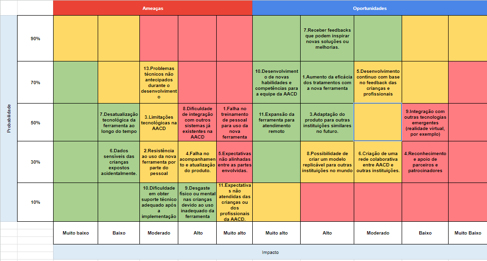

# Entendimento de negócio

*Escreva aqui o conteúdo deste artefato.*

## Matriz de Risco 

### **Ameaças:**

1. **Falha no treinamento de pessoal para uso da nova ferramenta.**
   - Justificativa: A eficácia do produto depende de uma operação correta.
   - Mitigação: Oferecer treinamento extensivo e materiais de apoio.

2. **Resistência ao uso da nova ferramenta por parte do pessoal.**
   - Justificativa: Mudanças podem enfrentar resistência inicial.
   - Mitigação: Demonstrar os benefícios claramente e envolver os funcionários no processo.

3. **Limitações tecnológicas na AACD.**
   - Justificativa: Dependência de infraestrutura tecnológica.
   - Mitigação: Avaliar a infraestrutura atual e adaptar o produto conforme necessário.

4. **Falha no acompanhamento e atualização do produto.**
   - Justificativa: Necessidade de manter o produto atualizado.
   - Mitigação: Estabelecer um canal direto de comunicação com a AACD.

5. **Expectativas não alinhadas entre as partes envolvidas.**
   - Justificativa: A compreensão clara das expectativas é crucial.
   - Mitigação: Comunicação transparente e feedbacks regulares.

6. **Dados sensíveis das crianças expostos acidentalmente.**
   - Justificativa: A proteção de dados é crucial.
   - Mitigação: Implementar sistemas de segurança robustos.

7. **Desatualização tecnológica da ferramenta ao longo do tempo.**
   - Justificativa: A tecnologia muda rapidamente.
   - Mitigação: Estabelecer atualizações periódicas.

8. **Dificuldade de integração com outros sistemas já existentes na AACD.**
   - Justificativa: Compatibilidade com sistemas antigos.
   - Mitigação: Análise técnica prévia e desenvolvimento de interfaces de integração.

9. **Desgaste físico ou mental nas crianças devido ao uso inadequado da ferramenta.**
   - Justificativa: O bem-estar das crianças é primordial.
   - Mitigação: Monitoramento constante e ajustes rápidos conforme feedback.

10. **Dificuldade em obter suporte técnico adequado após a implementação.**
   - Justificativa: A continuidade e eficácia da ferramenta dependem de suporte.
   - Mitigação: Estabelecer acordos de manutenção e suporte técnico.

11. **Expectativas não atendidas das crianças ou dos profissionais da AACD.**
   - Justificativa: Dissonância entre expectativa e realidade.
   - Mitigação: Comunicação clara e feedback constante.

12. **Problemas técnicos não antecipados durante o desenvolvimento.**
   - Justificativa: Desafios técnicos podem causar atrasos e exigir recursos adicionais.
   - Mitigação: Ter uma equipe técnica qualificada e preparada para resolver problemas rapidamente.

### **Oportunidades:**

1. **Aumento da eficácia dos tratamentos com a nova ferramenta.**
   - Justificativa: A principal meta do projeto.
   - Como aproveitar: Monitoramento constante e ajustes baseados no feedback.

2. **Capacitação e treinamento do pessoal da AACD.**
   - Justificativa: Pessoal capacitado pode melhorar a experiência das crianças.
   - Como aproveitar: Estabelecer parcerias de treinamento e workshops.

3. **Adaptação do produto para outras instituições similares no futuro.**
   - Justificativa: Expansão do impacto positivo.
   - Como aproveitar: Documentar o processo e estabelecer protocolos.

4. **Reconhecimento e apoio de parceiros e patrocinadores.**
   - Justificativa: Criação de uma rede de apoio.
   - Como aproveitar: Estratégia de comunicação e marketing.

5. **Desenvolvimento contínuo com base no feedback das crianças e profissionais.**
   - Justificativa: Melhorias contínuas baseadas em experiências reais.
   - Como aproveitar: Estabelecer canais de feedback e avaliações periódicas.

6. **Publicidade positiva para a AACD ao implementar tecnologia de ponta.**
   - Justificativa: Potencial de atrair mais apoiadores.
   - Como aproveitar: Estratégias de marketing e relações públicas.

10. **Criação de uma rede colaborativa entre AACD e outras instituições.**
   - Justificativa: Ampliação do impacto positivo.
   - Como aproveitar: Estabelecer parcerias e protocolos de cooperação.

7. **Receber feedbacks que podem inspirar novas soluções ou melhorias.**
   - Justificativa: O feedback é uma fonte rica de inovação.
   - Como aproveitar: Canais abertos e receptivos para sugestões.

8. **Possibilidade de criar um modelo replicável para outras instituições no mundo.**
   - Justificativa: Ampliação global do impacto positivo.
   - Como aproveitar: Documentação detalhada e estudos de caso.

9. **Integração com outras tecnologias emergentes (realidade virtual, por exemplo).**
   - Justificativa: O potencial da combinação de tecnologias.
   - Como aproveitar: Pesquisa e desenvolvimento contínuo.

10. **Desenvolvimento de novas habilidades e competências para a equipe da AACD.**
   - Justificativa: Capacitação contínua.
   - Como aproveitar: Treinamentos e workshops regulares.

11. **Expansão da ferramenta para atendimento remoto.**
   - Justificativa: A tendência crescente de telemedicina e atendimento à distância.
   - Como aproveitar: Investir em capacidades online e integração de plataformas.

